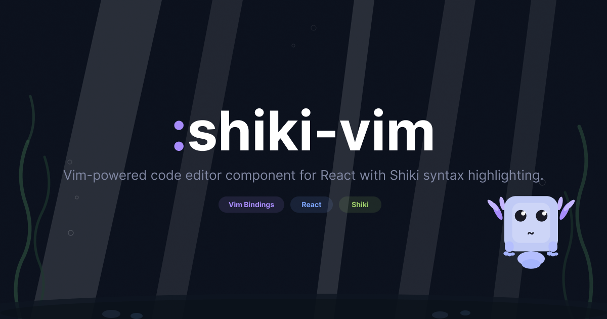

<h1 align="center">react.vim</h1>

<p align="center">
  Vim-powered code editor component for React with Shiki syntax highlighting.
</p>

<p align="center">
  <a href="https://react-vim.0xjj.dev">Documentation</a> ·
  <a href="https://react-vim.0xjj.dev/#playground">Playground</a> ·
  <a href="https://www.npmjs.com/package/react.vim">npm</a>
</p>

<p align="center">
  <a href="https://github.com/konojunya/react.vim/actions/workflows/ci.yaml"></a>
  <a href="https://www.npmjs.com/package/react.vim"></a>
  <a href="https://www.npmjs.com/package/react.vim"></a>
  <a href="https://bundlephobia.com/package/react.vim"></a>
  <a href="./LICENSE"></a>
</p>

---

Drop-in `<Vim />` component with real Vim modes, [Shiki](https://shiki.style/) highlighting, and zero configuration.

## Features

- **Real Vim Engine** — Not a wrapper around another editor. A purpose-built Vim engine in TypeScript with Normal, Insert, Visual, Visual-Line, Visual-Block, and Command-line modes.
- **Shiki Highlighting** — 60+ themes, 200+ languages. Same engine powering VS Code syntax highlighting.
- **Comprehensive Keybindings** — Motions, operators, counts, text objects, registers, macros, marks, dot-repeat, search, substitute, indent, and more. See [Supported Vim Features](#supported-vim-features) below.
- **Read-Only Mode** — `readOnly` prop for a zero-config code viewer with full navigation & search capabilities.
- **Tiny & Focused** — No heavy deps. React + Shiki. Tree-shakeable ESM, full TypeScript types.
- **Callback-driven** — `onSave`, `onYank`, `onChange`, `onModeChange`, `onAction` — you control what happens.
- **Customizable** — CSS variables for font, colors, cursor, selection, gutter, and status line. Shiki options are passed through transparently.
- **Extensible** — Internal hooks (`useVimEngine`, `useShikiTokens`) and core modules are exported for custom integrations.

## Install

```bash
npm install react.vim shiki react react-dom
```

`shiki`, `react`, and `react-dom` are peer dependencies.

## Quick Start

```tsx
import Vim from "react.vim";
import "react.vim/styles.css";
import { createHighlighter } from "shiki";

const highlighter = await createHighlighter({
  themes: ["vitesse-dark"],
  langs: ["typescript"],
});

function App() {
  return (
    <Vim
      content={`function greet(name: string) {\n  return "Hello, " + name;\n}`}
      highlighter={highlighter}
      lang="typescript"
      theme="vitesse-dark"
      onSave={(content) => {
        fetch("/api/save", { method: "POST", body: content });
      }}
      onYank={(text) => {
        navigator.clipboard.writeText(text);
      }}
    />
  );
}
```

> [Try it live in the playground](https://react-vim.0xjj.dev/#playground)

## Props

| Prop | Type | Default | Description |
|------|------|---------|-------------|
| `content` | `string` | *required* | The code to display and edit |
| `highlighter` | `HighlighterCore` | *required* | Shiki highlighter instance |
| `lang` | `string` | *required* | Language for syntax highlighting |
| `theme` | `string` | *required* | Shiki theme name |
| `shikiOptions` | `Record<string, unknown>` | — | Additional options passed to Shiki's `codeToTokens` |
| `cursorPosition` | `string` | `"1:1"` | Initial cursor position (`"line:col"`, 1-based) |
| `readOnly` | `boolean` | `false` | Disable editing (motions still work) |
| `autoFocus` | `boolean` | `false` | Focus the editor on mount |
| `indentStyle` | `"space" \| "tab"` | `"space"` | Use spaces or tabs for indentation |
| `indentWidth` | `number` | `2` | Number of spaces (or tab width) per indent level |
| `showLineNumbers` | `boolean` | `true` | Show line number gutter |
| `className` | `string` | — | Additional class for the container |

### Callbacks

| Prop | Signature | Trigger |
|------|-----------|---------|
| `onChange` | `(content: string) => void` | Any content edit |
| `onYank` | `(text: string) => void` | Text yanked (`yy`, `dw`, etc.) |
| `onSave` | `(content: string) => void` | `:w` command |
| `onModeChange` | `(mode: VimMode) => void` | Mode transition |
| `onAction` | `(action: VimAction, key: string) => void` | Every vim engine action (for debugging / logging) |

## Supported Vim Features

### Modes

| Key | Action |
|-----|--------|
| `i` `a` `I` `A` | Enter insert mode (before/after cursor, line start/end) |
| `o` `O` | Open line below / above and enter insert mode |
| `v` | Visual mode (character-wise) |
| `V` | Visual line mode |
| `Ctrl-V` | Visual block mode (rectangular selection) |
| `Escape` | Return to normal mode |

### Motions

| Key | Action |
|-----|--------|
| `h` `j` `k` `l` | Left / Down / Up / Right |
| `w` `e` `b` | Next word / End of word / Previous word |
| `W` `B` | Next WORD / Previous WORD (whitespace-delimited) |
| `0` `^` `$` | Line start / First non-blank / Line end |
| `gg` `G` | File start / File end (or `{count}gg`, `{count}G`) |
| `H` `M` `L` | Top / Middle / Bottom of visible screen |
| `f{char}` `F{char}` | Find char forward / backward |
| `t{char}` `T{char}` | Till char forward / backward |
| `;` `,` | Repeat last f/F/t/T forward / backward |
| `%` | Jump to matching bracket |
| `{count}{motion}` | Repeat motion (e.g. `5j`, `3w`, `10G`) |

### Operators

| Key | Action |
|-----|--------|
| `d{motion}` | Delete |
| `y{motion}` | Yank (copy) |
| `c{motion}` | Change (delete + enter insert) |
| `>{motion}` | Indent |
| `<{motion}` | Dedent |
| `dd` `yy` `cc` `>>` `<<` | Operate on whole line |
| `D` `C` | Delete / Change to end of line |
| `{count}{operator}{motion}` | e.g. `3dw`, `2yy`, `5>>` |

### Text Objects

Work with operators (`ciw`, `da"`) and visual mode (`viw`, `va(`).

| Key | Description |
|-----|-------------|
| `iw` / `aw` | Inner / a word |
| `iW` / `aW` | Inner / a WORD (whitespace-delimited) |
| `i"` / `a"` | Inner / a double-quoted string |
| `i'` / `a'` | Inner / a single-quoted string |
| `` i` `` / `` a` `` | Inner / a backtick-quoted string |
| `i(` / `a(` | Inner / a parentheses (also `i)` / `a)`) |
| `i{` / `a{` | Inner / a braces (also `i}` / `a}`) |
| `i[` / `a[` | Inner / a brackets (also `i]` / `a]`) |
| `i<` / `a<` | Inner / a angle brackets (also `i>` / `a>`) |

### Editing

| Key | Action |
|-----|--------|
| `x` | Delete character under cursor |
| `r{char}` | Replace character under cursor |
| `~` | Toggle case and advance cursor |
| `p` / `P` | Paste after / before cursor |
| `J` | Join current line with next |
| `u` / `Ctrl-R` | Undo / Redo |
| `.` | Repeat last change |

### Registers

| Key | Action |
|-----|--------|
| `"ayy` | Yank line into register `a` |
| `"ap` | Paste from register `a` |
| `"a`-`"z` | 26 named registers, persist across operations |
| `""` | Unnamed register (default) |

### Macros

| Key | Action |
|-----|--------|
| `qa` | Start recording macro into register `a` |
| `q` | Stop recording |
| `@a` | Play macro from register `a` |
| `@@` | Repeat last played macro |

### Marks

| Key | Action |
|-----|--------|
| `ma` | Set mark `a` at current cursor position |
| `` `a `` | Jump to exact position of mark `a` |
| `'a` | Jump to line of mark `a` |
| `a`-`z` | 26 local marks available |

### Search & Commands

| Key | Action |
|-----|--------|
| `/{pattern}` | Search forward (regex) |
| `?{pattern}` | Search backward (regex) |
| `n` / `N` | Next / Previous match |
| `*` / `#` | Search word under cursor forward / backward |
| `Ctrl-U` / `Ctrl-D` | Half page up / down |
| `Ctrl-B` / `Ctrl-F` | Full page up / down |
| `:w` | Save |
| `:{number}` | Go to line |
| `:s/old/new/g` | Substitute (current line, `%` for all lines) |
| `:set number` / `:set nonumber` | Toggle line numbers |

### Visual Block Mode

| Key | Action |
|-----|--------|
| `Ctrl-V` | Enter visual block mode |
| `I` | Insert at left edge of block (replicated on Escape) |
| `A` | Append at right edge of block (replicated on Escape) |
| `d` `y` `c` | Operate on rectangular selection |
| `o` | Swap anchor and cursor |

### Status Line

The status line automatically shows contextual information:

- Mode indicator (`-- INSERT --`, `-- VISUAL --`, `-- VISUAL BLOCK --`, etc.)
- Operation feedback (`6 lines yanked`, `3 fewer lines`, `4 more lines`)
- Register info (`6 lines yanked into "a`)
- Macro recording indicator (`recording @a`)
- Search / command input (`:`, `/`, `?`)
- Cursor position (line:col)

## Styling

Override CSS variables for visual customization. Behavioral settings like indentation are controlled via [props](#props).

```css
.sv-container {
  --sv-font-family: "JetBrains Mono", monospace;
  --sv-font-size: 14px;
  --sv-line-height: 1.5;
  --sv-cursor-color: rgba(255, 255, 255, 0.6);
  --sv-selection-bg: rgba(100, 150, 255, 0.3);
  --sv-gutter-color: #858585;
  --sv-statusline-bg: #252526;
  --sv-statusline-fg: #cccccc;
  --sv-focus-color: #007acc;
}
```

> Tab display width is controlled by the `indentWidth` prop, not CSS.

## Hooks

For advanced use cases, the internal hooks are exported:

```tsx
import { useVimEngine, useShikiTokens } from "react.vim";

const engine = useVimEngine({
  content: "hello world",
  onSave: (content) => { /* ... */ },
});

// engine.cursor, engine.mode, engine.handleKeyDown, etc.
```

## Contributing

### Setup

```bash
bun install
bun run dev         # Watch mode (builds the library)
bun run test        # Run tests
bun run typecheck   # Type check
bun run lint        # oxlint
bun run fmt         # oxfmt
```

### Debug App

A local debug app lives in `debug/`. It references the react.vim source directly via Vite aliases — no build step needed for live feedback.

```bash
cd debug
bun install
bun run dev
```

The debug app includes:

- **Theme / Language selectors** — switch Shiki themes and languages on the fly
- **Indent controls** — toggle between Tab and Space indentation with width selection
- **CSS variable controls** — adjust colors, font size, line height, etc. with color pickers and sliders
- **Operation history** — every vim action is logged with the triggering key (`<cursor-move> [j] -> 5:1`)
- **"Copy for LLM" button** — copies the full operation log, editor state, and settings as a markdown report you can paste directly into a bug report or LLM conversation

Changes to files under `src/` are reflected immediately in the debug app via HMR.

### Workflow

1. Start the debug app (`cd debug && bun run dev`)
2. Make changes to the library source in `src/`
3. Test your changes interactively in the browser
4. Use "Copy for LLM" in the history panel if you need to report unexpected behavior
5. Run `bun run test` before submitting a PR

PRs are welcome! Please make sure `bun run test` and `bun run typecheck` pass before submitting.

## License

[MIT](./LICENSE) &copy; [JJ](https://github.com/konojunya)
